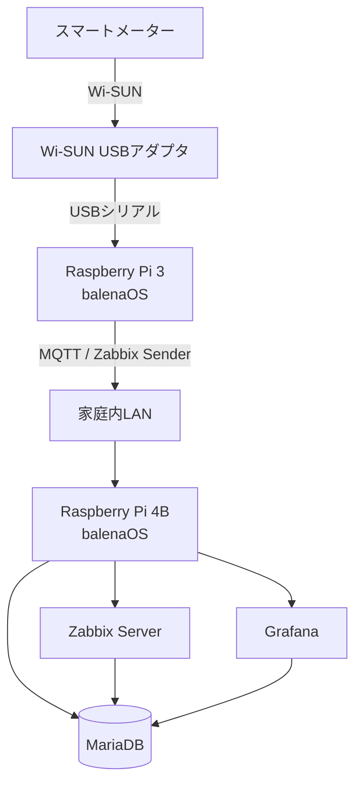
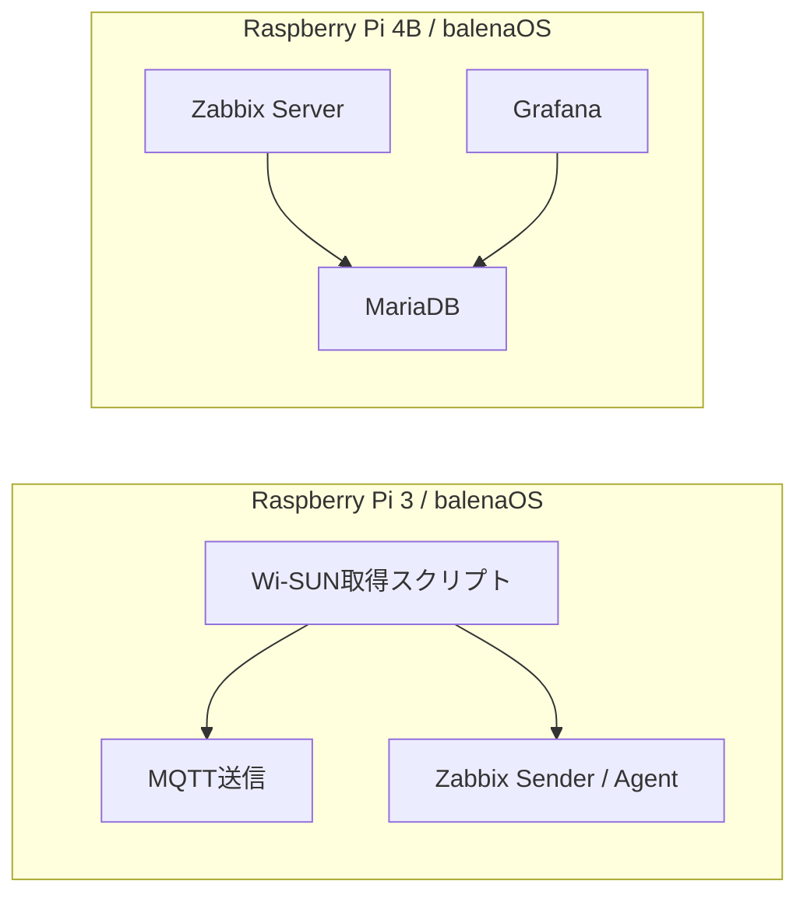
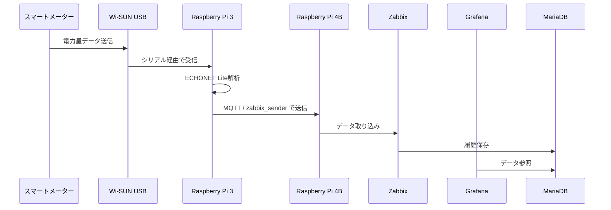
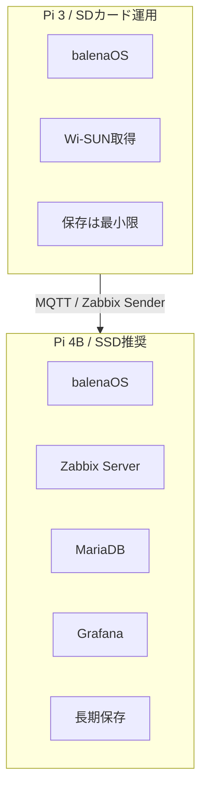
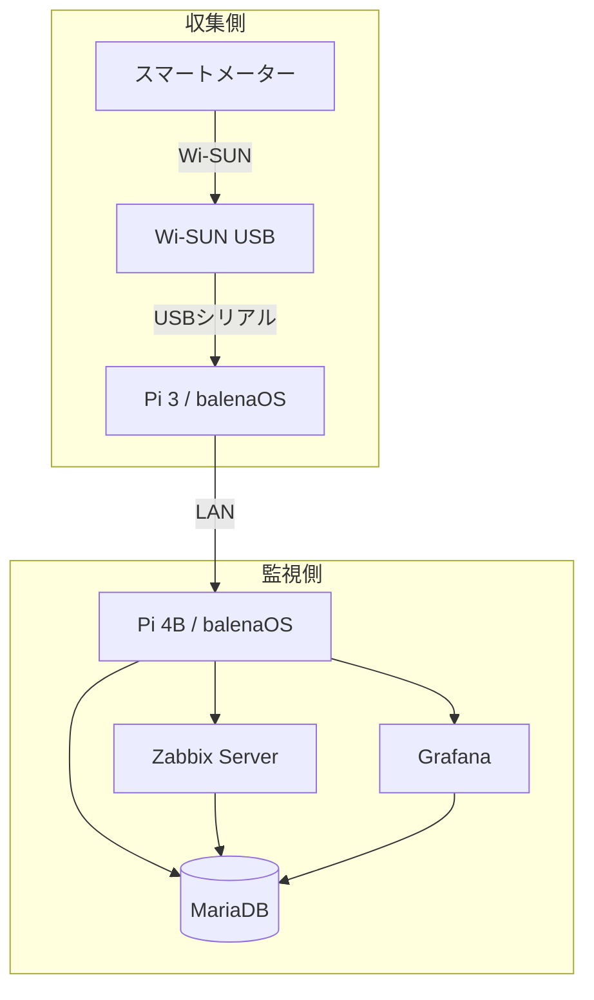

# Wi-SUN 電力監視システム構成図

## 全体構成

```mermaid
flowchart TB
    SM[スマートメーター] -->|Wi-SUN| USB[Wi-SUN USBアダプタ]
    USB -->|USBシリアル| PI3[ Raspberry Pi 3<br/>balenaOS ]
    PI3 -->|MQTT / Zabbix Sender| LAN[家庭内LAN]
    LAN --> PI4[ Raspberry Pi 4B<br/>balenaOS ]
    PI4 --> ZBX[Zabbix Server]
    PI4 --> DB[(MariaDB)]
    PI4 --> GRA[Grafana]

    ZBX --> DB
    GRA --> DB
```

---

## 役割分担

```mermaid
flowchart LR
    subgraph PI3[ Raspberry Pi 3 / balenaOS ]
        W1[Wi-SUN取得スクリプト]
        W2[MQTT送信]
        W3[Zabbix Sender / Agent]
    end

    subgraph PI4[ Raspberry Pi 4B / balenaOS ]
        S1[Zabbix Server]
        S2[MariaDB]
        S3[Grafana]
    end

    W1 --> W2
    W1 --> W3
    S1 --> S2
    S3 --> S2
```

---

## データの流れ

```mermaid
sequenceDiagram
    participant M as スマートメーター
    participant U as Wi-SUN USB
    participant P3 as Raspberry Pi 3
    participant P4 as Raspberry Pi 4B
    participant Z as Zabbix
    participant G as Grafana
    participant D as MariaDB

    M->>U: 電力量データ送信
    U->>P3: シリアル経由で受信
    P3->>P3: ECHONET Lite解析
    P3->>P4: MQTT / zabbix_sender で送信
    P4->>Z: データ取り込み
    Z->>D: 履歴保存
    G->>D: データ参照
```

---

## ストレージ注意込み構成

```mermaid
flowchart TB
    subgraph PI3SD[Pi 3 / SDカード運用]
        A1[balenaOS]
        A2[Wi-SUN取得]
        A3[保存は最小限]
    end

    subgraph PI4SSD[Pi 4B / SSD推奨]
        B1[balenaOS]
        B2[Zabbix Server]
        B3[MariaDB]
        B4[Grafana]
        B5[長期保存]
    end

    PI3SD -->|MQTT / Zabbix Sender| PI4SSD
```

---

## ネットワーク視点の構成図

```mermaid
flowchart TB
    subgraph FIELD[収集側]
        SM2[スマートメーター]
        WS[Wi-SUN USB]
        R3[Pi 3 / balenaOS]
    end

    subgraph MONITOR[監視側]
        R4[Pi 4B / balenaOS]
        ZS[Zabbix Server]
        MDB[(MariaDB)]
        GF[Grafana]
    end

    SM2 -->|Wi-SUN| WS
    WS -->|USBシリアル| R3
    R3 -->|LAN| R4
    R4 --> ZS
    R4 --> MDB
    R4 --> GF
    ZS --> MDB
    GF --> MDB
```
